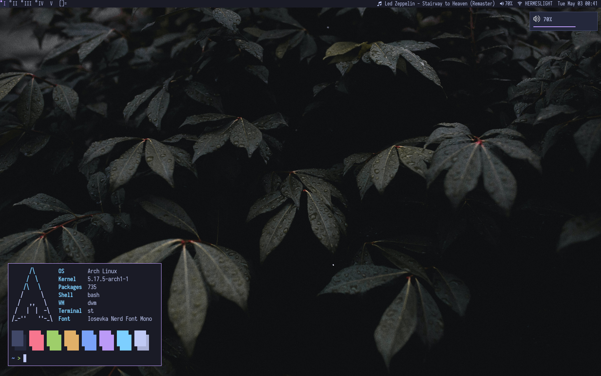

# dwm - dynamic window manager
>dwm is an extremely fast, small, and dynamic window manager for X.



## Table of Content

* [Requirements](#requirements)
* [Installation](#installation)
* [Running dwm with startx](#running-dwm-with-startx)
* [Statusbar](#statusbar)
* [Configuration](#configuration)
* [Patches](#patches)

## Requirements

In order to build dwm you need the Xlib header files.

## Installation

```
$ git clone https://github.com/lr-tech/dwm.git
$ cd dwm
$ sudo make clean install
```

## Running dwm with startx

Add the following line to your .xinitrc to start dwm using startx:

```
exec dwm
```

In order to connect dwm to a specific display, make sure that
the DISPLAY environment variable is set correctly, e.g.:

    DISPLAY=foo.bar:1 exec dwm

(This will start dwm on display :1 of the host foo.bar.)

## Statusbar

In order to display status info in the bar, you will need `dwmstatus.sh` and
`sb-*` scripts from [my dotfiles](https://github.com/lr-tech/dotfiles/tree/master/.local/bin).
Just make sure you add them all to the same directory and feel free to modify
them to suit your needs. Then add the `dwmstatus.sh` script to your autostart
program. For example, for startx:

```
~/path/to/dwmstatus.sh &
exec dwm
```

## Configuration

The configuration of dwm is done by modifying `config.def.h` or by creating a
custom `config.h` and (re)compiling the source code.

## Patches

Some patches have been applied based on my personal taste:

- [alwayscenter-20200625-f04cac6](https://dwm.suckless.org/patches/alwayscenter/)
- [attachbelow-6.2](https://dwm.suckless.org/patches/attachbelow/)
- [movestack-20211115-a786211](https://dwm.suckless.org/patches/movestack/)
- [notitle-20210715-138b405](https://dwm.suckless.org/patches/notitle/)
- [pertag-togglelayout-6.3_full](https://github.com/bakkeby/patches/blob/master/dwm/dwm-pertag-togglelayout-6.3_full.diff)
- [removeborder-20200520-f09418b](https://dwm.suckless.org/patches/removeborder/)
- [swallow-20201211-61bb8b2](https://dwm.suckless.org/patches/swallow/)
- [xresources-20210827-138b405](https://dwm.suckless.org/patches/xresources/)
